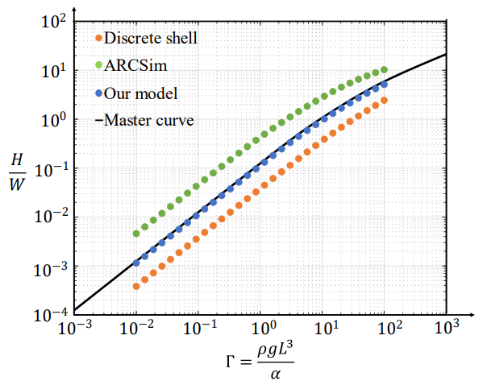

This folder contains `MATLAB` code to compare different bending models, such as Discrete Shell [Grinspun 2013], ARCSim bending model [Narain 2012] and Ours.

Please run `main.m` to get the validation result: 